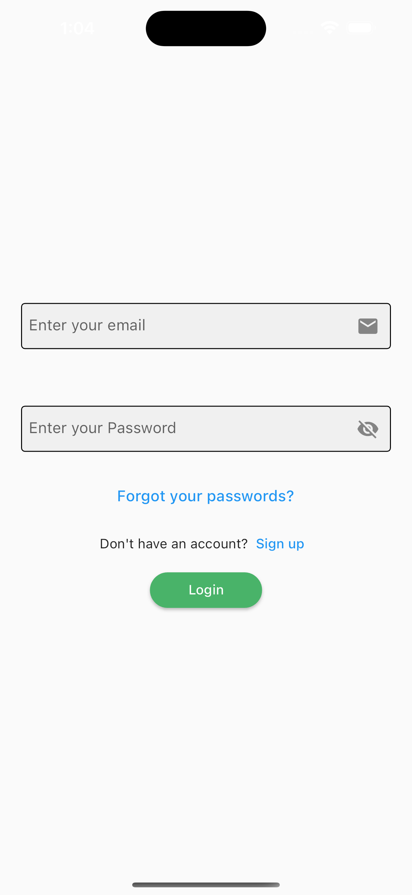
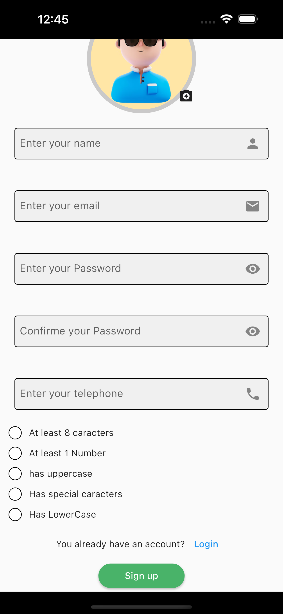
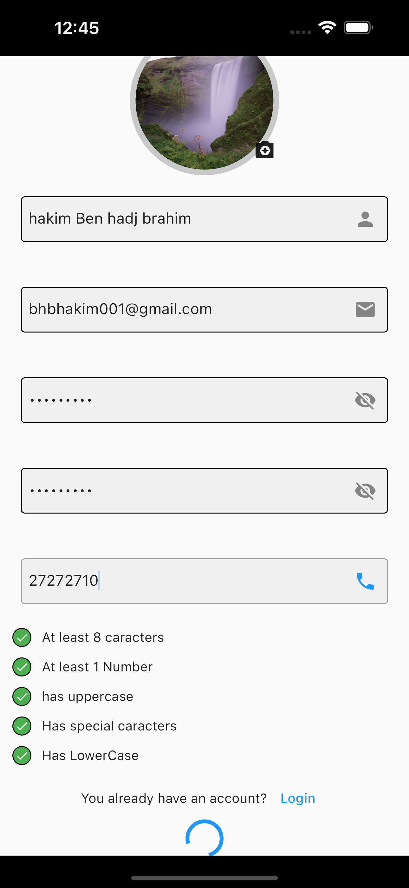
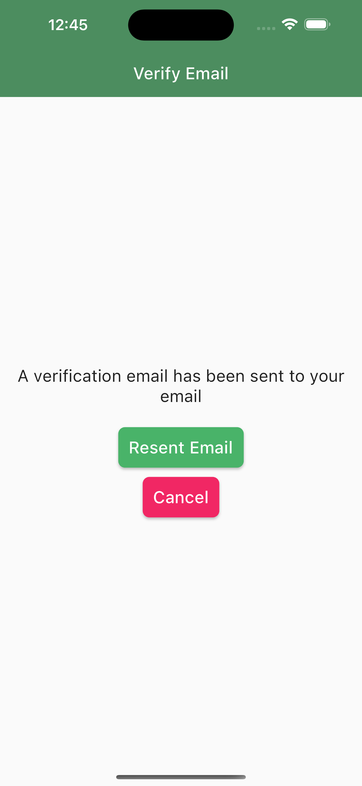
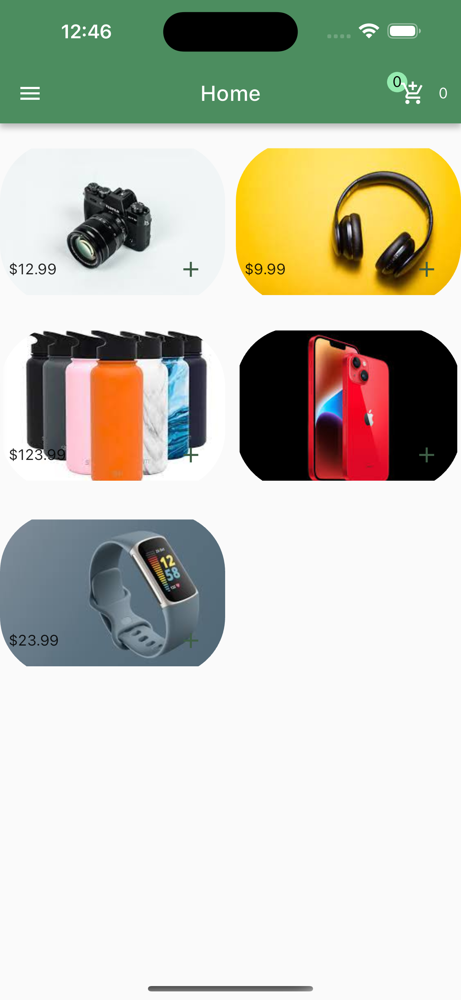
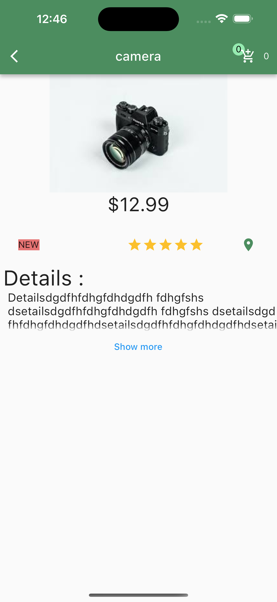
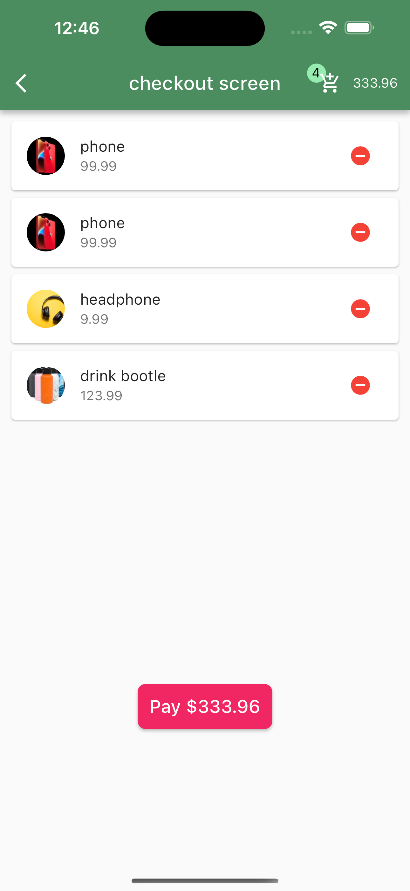
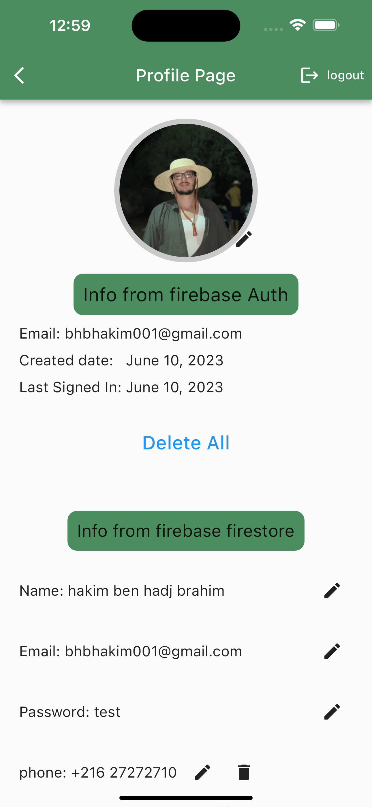
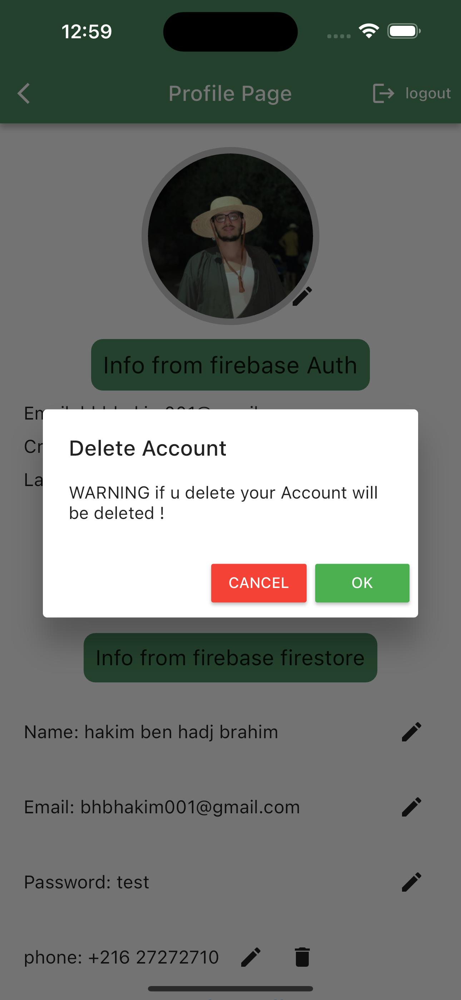

# E-commerce App

This is a mobile application developed using Flutter and Firebase for iOS and Android platforms. The app provides various features for e-commerce functionality, including user authentication, product listing, and checkout process.

## Features

The E-commerce app offers the following features:

- User Authentication: The app allows users to sign up, log in, and reset their password. Users can also verify their email address during the signup process.
- Product Listing: Users can view a list of available products with details such as name, price, and image.
- Product Details: Users can access detailed information about a specific product, including its description and image.
- Cart and Checkout: Users can add products to their cart and proceed to the checkout process for order confirmation.
- User Profile: Users have access to their profile, which displays their information and allows them to update their avatar photo.
- Account Management: Users can delete their data or remove their entire account from the app.

## Screenshots

## License

The E-commerce app is open-source and released under the [MIT License](https://opensource.org/licenses/MIT). You are free to use, modify, and distribute the code as per the terms of the license.

## Contact Information

If you have any questions or feedback about Want to Trip!, please don't hesitate to contact me at bhbhakim123@gmail.com 

Github: hakimbhb

